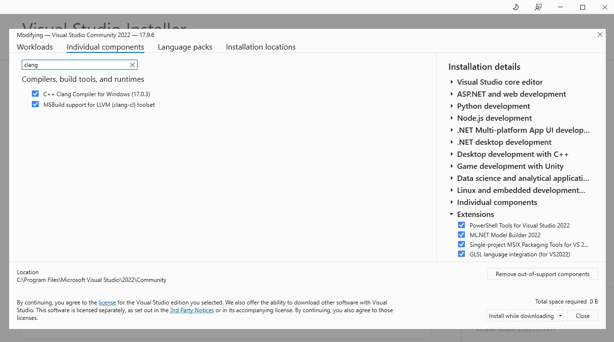

# Build Micro Websockets 

## Install Depemdencies

Note: when in windows commands are run using [git-bash](https://git-scm.com/downloads) terminal or powershell terminal.

### Install vcpkg (windows only)

In git-bash terminal run:

```
> cd /c/w1
> git clone https://github.com/microsoft/vcpkg.git
> cd vcpkg
> ./bootstrap-vcpkg.bat
```

### Install libraries (windows only)

In git-bash terminalC run:

```
> /c/w1/vcpkg/vcpkg install libuv:x64-windows
> /c/w1/vcpkg/vcpkg install zlib:x64-windows
```

### Install MS Visual Studio Community and ensure it has clang compiler installed (windows only)

Open MS Visual Studio Installer  and verify that clang is installed.




## Build Micro websockets

[also see](https://github.com/uNetworking/uWebSockets/actions/runs/8217383674/workflow)

### Windows Build

Clone the [repository](https://github.com/uNetworking/uWebSockets.git) inside the project root.


```
> cd /c/w2/avocado
> git clone --recursive https://github.com/uNetworking/uWebSockets.git
```

Open  'x64 tools command prompt' terminal which was installed as part of visual studio installation and run:

```
> cd \w1\gaow
> cd .\uWebSockets\
> powershell
> ..\scripts\uWebSockets_build.ps1

```

### Linux Build

Clone the [repository](https://github.com/uNetworking/uWebSockets.git) inside the project root.


```
~/w2/avocado> git clone --recursive https://github.com/uNetworking/uWebSockets.git
```

Build uWebSockets:

```
~/w2/avocado> cd uWebSockets
~/w2/avocado/uWebSockets> make
```
# Build project

We build project using [clang platform toolset](https://learn.microsoft.com/en-us/gaming/gdk/_content/gc/tools-pc/visualstudio/gr-vs-clang),
[also see CMAKE_GENERATOR_TOOLSET](https://cmake.org/cmake/help/latest/generator/Visual%20Studio%2017%202022.html).

In powershell terminal:

```
> mkdir /w1/gaow_build
> cd /w1/gaow_build
> cmake -T clangcl ../gaow
```


